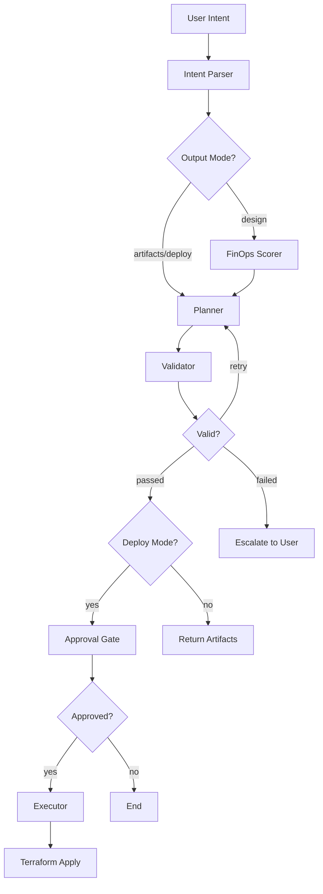

# AI DevOps Agent Platform — Architecture

## System Overview

```
┌─────────────────────────────────────────────────────────────────────────────┐
│                         AI DevOps Agent Platform                            │
│                                                                             │
│  "Deploy a scalable web app on AWS with CI/CD"                             │
│                              │                                              │
│                              ▼                                              │
│  ┌───────────────────────────────────────────────────────────────────────┐  │
│  │                        INTENT LAYER                                   │  │
│  │  ┌─────────────┐    ┌─────────────┐    ┌─────────────┐               │  │
│  │  │   Intent    │───▶│  Conflict   │───▶│    OPA      │               │  │
│  │  │   Parser    │    │  Detector   │    │  Security   │               │  │
│  │  └─────────────┘    └─────────────┘    └─────────────┘               │  │
│  │         │                                     │                       │  │
│  │         ▼                                     ▼                       │  │
│  │  ┌─────────────────────────────────────────────────┐                 │  │
│  │  │              IntentSpec (Canonical)              │                 │  │
│  │  │  • Task Intent (compute, networking, CI/CD)      │                 │  │
│  │  │  • Meta Intent (cost, security, reliability)     │                 │  │
│  │  │  • Constraints (region, budget, compliance)      │                 │  │
│  │  │  • Confidence: stated | confirmed | inferred     │                 │  │
│  │  └─────────────────────────────────────────────────┘                 │  │
│  └───────────────────────────────────────────────────────────────────────┘  │
│                              │                                              │
│                              ▼                                              │
│  ┌───────────────────────────────────────────────────────────────────────┐  │
│  │                      REASONING LAYER                                  │  │
│  │  ┌─────────────┐    ┌─────────────┐    ┌─────────────┐               │  │
│  │  │   FinOps    │    │    DAG      │    │   Smart     │               │  │
│  │  │   Scorer    │───▶│  Executor   │───▶│  Replanner  │               │  │
│  │  │   (ToT)     │    │             │    │   (CoT)     │               │  │
│  │  └─────────────┘    └─────────────┘    └─────────────┘               │  │
│  └───────────────────────────────────────────────────────────────────────┘  │
│                              │                                              │
│                              ▼                                              │
│  ┌───────────────────────────────────────────────────────────────────────┐  │
│  │                     GENERATION LAYER                                  │  │
│  │  ┌─────────────┐    ┌─────────────┐    ┌─────────────┐               │  │
│  │  │  Terraform  │    │    IAM      │    │   CI/CD     │               │  │
│  │  │  Generator  │    │  Generator  │    │  Generator  │               │  │
│  │  └─────────────┘    └─────────────┘    └─────────────┘               │  │
│  └───────────────────────────────────────────────────────────────────────┘  │
│                              │                                              │
│                              ▼                                              │
│  ┌───────────────────────────────────────────────────────────────────────┐  │
│  │                     VALIDATION LAYER                                  │  │
│  │  ┌──────────────────────────────────────────────────────────────┐    │  │
│  │  │                   Validation Loop                             │    │  │
│  │  │  Error → Classify (15 types) → Fix Strategy → Regenerate     │    │  │
│  │  │  (max 3 attempts, NOT naive retry)                            │    │  │
│  │  └──────────────────────────────────────────────────────────────┘    │  │
│  └───────────────────────────────────────────────────────────────────────┘  │
│                              │                                              │
│                              ▼                                              │
│  ┌───────────────────────────────────────────────────────────────────────┐  │
│  │                      APPROVAL LAYER                                   │  │
│  │  ┌─────────────────────────────────────────────────────────────┐     │  │
│  │  │  Human-in-the-Loop Approval Gate                            │     │  │
│  │  │  • Blast radius calculation                                  │     │  │
│  │  │  • Cost delta display                                        │     │  │
│  │  │  • Timeout: 300s (configurable)                              │     │  │
│  │  └─────────────────────────────────────────────────────────────┘     │  │
│  └───────────────────────────────────────────────────────────────────────┘  │
│                              │                                              │
│                              ▼                                              │
│  ┌───────────────────────────────────────────────────────────────────────┐  │
│  │                      OUTPUT ARTIFACTS                                 │  │
│  │  ┌─────────────┐    ┌─────────────┐    ┌─────────────┐               │  │
│  │  │  main.tf    │    │  iam.tf     │    │  deploy.yml │               │  │
│  │  │  vpc.tf     │    │  policy.json│    │  (GitHub    │               │  │
│  │  │  eks.tf     │    │             │    │   Actions)  │               │  │
│  │  └─────────────┘    └─────────────┘    └─────────────┘               │  │
│  └───────────────────────────────────────────────────────────────────────┘  │
│                                                                             │
└─────────────────────────────────────────────────────────────────────────────┘
```

## LangGraph Workflow



## Component Details

### 1. Intent Layer

| Component | Purpose | Key Features |
|-----------|---------|--------------|
| **Intent Parser** | Extract structured intent from natural language | Semantic extraction, confidence scoring |
| **Conflict Detector** | Identify contradictions in requirements | 8 DevOps conflict patterns |
| **OPA Security** | Block dangerous configurations | Wildcard IAM, open security groups, prompt injection |

### 2. Reasoning Layer

| Component | Purpose | Key Features |
|-----------|---------|--------------|
| **FinOps Scorer** | Evaluate architecture options | Tree-of-Thought, 4 scoring dimensions |
| **DAG Executor** | Execute tasks with dependencies | Topological sort, parallel execution |
| **Smart Replanner** | Fix errors intelligently | Chain-of-Thought, targeted regeneration |

### 3. Generation Layer

| Component | Purpose | Output |
|-----------|---------|--------|
| **Terraform Generator** | Infrastructure as Code | `main.tf`, `vpc.tf`, `eks.tf` |
| **IAM Generator** | Security policies | `iam.tf`, `policy.json` |
| **CI/CD Generator** | Deployment pipelines | GitHub Actions, GitLab CI |

### 4. Validation Layer

```
┌─────────────────────────────────────────────────────────────────┐
│                      Validation Loop                            │
│                                                                 │
│  ┌──────────┐    ┌──────────────┐    ┌──────────────┐          │
│  │ Terraform │───▶│    Error     │───▶│  Smart       │          │
│  │ Validate  │    │ Classifier   │    │ Replanner    │          │
│  └──────────┘    │ (15 types)   │    │ (targeted)   │          │
│       │          └──────────────┘    └──────────────┘          │
│       │                                     │                   │
│       ▼                                     ▼                   │
│  ┌──────────────────────────────────────────────────┐          │
│  │  Retry Loop (max 3 attempts)                      │          │
│  │  • Attempt 1: Original generation                 │          │
│  │  • Attempt 2: Targeted fix based on error type    │          │
│  │  • Attempt 3: Alternative approach                │          │
│  │  • Escalate: User intervention required           │          │
│  └──────────────────────────────────────────────────┘          │
└─────────────────────────────────────────────────────────────────┘
```

### 5. Approval Layer

```
┌─────────────────────────────────────────────────────────────────┐
│                    Approval Gate                                 │
│                                                                 │
│  ┌──────────────────────────────────────────────────────────┐  │
│  │  Blast Radius Calculation                                 │  │
│  │  • Resources to create: 12                                │  │
│  │  • Resources to update: 0                                 │  │
│  │  • Resources to delete: 2  ⚠️ HIGH RISK                  │  │
│  │  • Resources to replace: 1                                │  │
│  └──────────────────────────────────────────────────────────┘  │
│                                                                 │
│  ┌──────────────────────────────────────────────────────────┐  │
│  │  Cost Delta                                               │  │
│  │  • Current: $150/month                                    │  │
│  │  • After: $250/month                                      │  │
│  │  • Delta: +$100/month (+67%)                              │  │
│  └──────────────────────────────────────────────────────────┘  │
│                                                                 │
│  ┌──────────────────────────────────────────────────────────┐  │
│  │  [APPROVE]  [REJECT]          Timeout: 300s              │  │
│  └──────────────────────────────────────────────────────────┘  │
└─────────────────────────────────────────────────────────────────┘
```

## Observability

```
┌─────────────────────────────────────────────────────────────────┐
│                    Observability Stack                          │
│                                                                 │
│  ┌─────────────┐    ┌─────────────┐    ┌─────────────┐         │
│  │ OpenTelemetry│───▶│   Jaeger    │    │  Grafana    │         │
│  │   (Traces)  │    │  (Traces)   │    │ (Dashboards)│         │
│  └─────────────┘    └─────────────┘    └─────────────┘         │
│         │                                     ▲                 │
│         ▼                                     │                 │
│  ┌─────────────┐                      ┌─────────────┐          │
│  │ Prometheus  │─────────────────────▶│  30+ Metrics│          │
│  │  (Metrics)  │                      │  • LLM calls │          │
│  └─────────────┘                      │  • Node time │          │
│                                       │  • Retries   │          │
│                                       │  • FinOps    │          │
│                                       │  • Sessions  │          │
│                                       └─────────────┘          │
└─────────────────────────────────────────────────────────────────┘
```

## Data Flow

```
User Message
     │
     ▼
┌─────────────────────┐
│  Semantic Extractor │──────▶ ExtractionResult
└─────────────────────┘              │
                                     ▼
                              ┌─────────────┐
                              │  OPA Check  │──────▶ DENY (if policy violation)
                              └─────────────┘
                                     │
                                     ▼ ALLOW
                              ┌─────────────┐
                              │ IntentSpec  │◀────── Confidence Transitions
                              │  (merge)    │        (speculative → confirmed)
                              └─────────────┘
                                     │
                                     ▼
                              ┌─────────────┐
                              │  Generators │──────▶ Terraform, IAM, CI/CD
                              └─────────────┘
                                     │
                                     ▼
                              ┌─────────────┐
                              │  Validator  │──────▶ Error Classification
                              └─────────────┘        (if failed)
                                     │
                                     ▼
                              ┌─────────────┐
                              │  Approval   │──────▶ Human Decision
                              │    Gate     │
                              └─────────────┘
                                     │
                                     ▼
                              ┌─────────────┐
                              │  Executor   │──────▶ terraform apply
                              └─────────────┘
```

## Security Model

```
┌─────────────────────────────────────────────────────────────────┐
│                     Security Layers                             │
│                                                                 │
│  Layer 1: Intent Layer (OPA)                                    │
│  ├── Block wildcard IAM (Resource: "*")                         │
│  ├── Block open security groups (0.0.0.0/0 on sensitive ports) │
│  ├── Detect prompt injection (15 patterns)                      │
│  └── Validate intent structure                                  │
│                                                                 │
│  Layer 2: Generation Layer                                      │
│  ├── IAM least-privilege by default                             │
│  ├── Encryption at rest enabled                                 │
│  └── VPC with private subnets                                   │
│                                                                 │
│  Layer 3: Approval Layer                                        │
│  ├── Human approval for destructive operations                  │
│  ├── Blast radius visibility                                    │
│  └── Timeout protection (300s)                                  │
│                                                                 │
│  Layer 4: Session Layer                                         │
│  ├── Multi-tenant isolation                                     │
│  ├── Tenant A cannot access Tenant B                            │
│  └── Session expiration (24h)                                   │
└─────────────────────────────────────────────────────────────────┘
```
